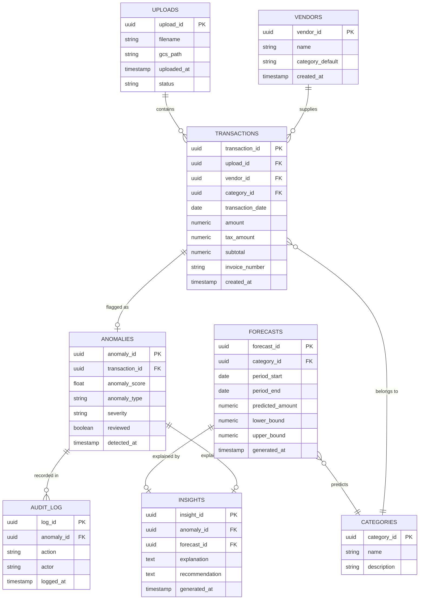

# Database Design
## Sentinel: Spend Anomaly & Forecast Intelligence Dashboard

**Engine:** PostgreSQL (Cloud SQL) — SQLite acceptable as a local prelim fallback

---

## 1. Entity-Relationship Diagram

---

## 2. Table Specifications

### 2.1 `vendors`
| Column | Type | Constraints | Notes |
|---|---|---|---|
| vendor_id | UUID | PK, default gen_random_uuid() | |
| name | VARCHAR(255) | NOT NULL | Normalized vendor name |
| category_default | VARCHAR(100) | NULL | Most common category for this vendor |
| created_at | TIMESTAMP | NOT NULL, default now() | |

### 2.2 `categories`
| Column | Type | Constraints | Notes |
|---|---|---|---|
| category_id | UUID | PK | |
| name | VARCHAR(100) | NOT NULL, UNIQUE | e.g. "Office Supplies", "Travel" |
| description | TEXT | NULL | |

### 2.3 `uploads`
| Column | Type | Constraints | Notes |
|---|---|---|---|
| upload_id | UUID | PK | |
| filename | VARCHAR(255) | NOT NULL | Original filename |
| gcs_path | VARCHAR(512) | NOT NULL | Path in Cloud Storage |
| uploaded_at | TIMESTAMP | NOT NULL, default now() | |
| status | VARCHAR(50) | NOT NULL, default 'pending' | pending / processing / complete / failed |

### 2.4 `transactions`
| Column | Type | Constraints | Notes |
|---|---|---|---|
| transaction_id | UUID | PK | |
| upload_id | UUID | FK → uploads | |
| vendor_id | UUID | FK → vendors | |
| category_id | UUID | FK → categories | |
| transaction_date | DATE | NOT NULL | |
| amount | NUMERIC(12,2) | NOT NULL | Grand total |
| tax_amount | NUMERIC(12,2) | NULL | |
| subtotal | NUMERIC(12,2) | NULL | For math-validation checks |
| invoice_number | VARCHAR(100) | NULL | Used for duplicate detection |
| created_at | TIMESTAMP | NOT NULL, default now() | |

**Indexes:** `(vendor_id, transaction_date)`, `(invoice_number)` — supports duplicate lookup and time-series queries.

### 2.5 `anomalies`
| Column | Type | Constraints | Notes |
|---|---|---|---|
| anomaly_id | UUID | PK | |
| transaction_id | UUID | FK → transactions, UNIQUE | One anomaly record per transaction |
| anomaly_score | FLOAT | NOT NULL | Isolation Forest output score |
| anomaly_type | VARCHAR(50) | NOT NULL | 'outlier' / 'duplicate' / 'math_error' / 'policy_violation' |
| severity | VARCHAR(20) | NOT NULL | 'low' / 'medium' / 'high' |
| reviewed | BOOLEAN | NOT NULL, default false | |
| detected_at | TIMESTAMP | NOT NULL, default now() | |

### 2.6 `forecasts`
| Column | Type | Constraints | Notes |
|---|---|---|---|
| forecast_id | UUID | PK | |
| category_id | UUID | FK → categories, NULL = overall spend | |
| period_start | DATE | NOT NULL | |
| period_end | DATE | NOT NULL | |
| predicted_amount | NUMERIC(12,2) | NOT NULL | Point estimate |
| lower_bound | NUMERIC(12,2) | NOT NULL | Confidence interval lower |
| upper_bound | NUMERIC(12,2) | NOT NULL | Confidence interval upper |
| generated_at | TIMESTAMP | NOT NULL, default now() | |

### 2.7 `insights`
| Column | Type | Constraints | Notes |
|---|---|---|---|
| insight_id | UUID | PK | |
| anomaly_id | UUID | FK → anomalies, NULL if forecast-related | |
| forecast_id | UUID | FK → forecasts, NULL if anomaly-related | |
| explanation | TEXT | NOT NULL | AI-generated plain-language explanation |
| recommendation | TEXT | NULL | AI-generated suggested action |
| generated_at | TIMESTAMP | NOT NULL, default now() | |

### 2.8 `audit_log`
| Column | Type | Constraints | Notes |
|---|---|---|---|
| log_id | UUID | PK | |
| anomaly_id | UUID | FK → anomalies | |
| action | VARCHAR(100) | NOT NULL | 'detected' / 'reviewed' / 'dismissed' / 'notified' |
| actor | VARCHAR(100) | NULL | 'system' or user identifier |
| logged_at | TIMESTAMP | NOT NULL, default now() | |

---

## 3. Design Notes

- **Why UUIDs:** Avoids collision issues across concurrent uploads/demo runs; safe for distributed/serverless writes.
- **Why separate `insights` from `anomalies`/`forecasts`:** Keeps AI-generated text decoupled — allows regenerating explanations without touching detection results.
- **Prelim shortcut:** For the preliminary round, `uploads`, `vendors`, and `categories` can be simplified/denormalized (e.g., vendor name as a plain string column on `transactions`) to save setup time — normalize for the final round.
- **Duplicate detection query pattern:** `SELECT * FROM transactions WHERE vendor_id = ? AND amount = ? AND transaction_date BETWEEN ? AND ?` (±3 day window).