# UI/UX Specification
## Sentinel: Spend Anomaly & Forecast Intelligence Dashboard

---

## 1. Design Principles

1. **Clarity over cleverness** — a finance manager with no ML background should understand every screen in under 10 seconds.
2. **Show the "why," not just the "what"** — every flag/number is paired with a plain-language explanation.
3. **Confidence, not false precision** — forecasts always show a range, never a single misleading number.
4. **Progressive disclosure** — dashboard shows summary first; details appear on demand (click-through), not all at once.

---

## 2. Information Architecture

```
Dashboard (Home)
├── Upload Panel
├── Summary Bar (KPIs)
├── Tab: Anomalies
│    └── Anomaly Detail Modal
├── Tab: Forecast
│    └── What-If Panel (final round)
└── Tab: Insights Feed
```

---

## 3. Screen-by-Screen Specification

### 3.1 Upload Screen
**Purpose:** Entry point — get spend data into the system.

| Element | Behavior |
|---|---|
| Drag-and-drop zone | Accepts CSV/XLSX; shows filename + row count on success |
| "Process" button | Disabled until valid file is loaded |
| Progress indicator | Shows "Uploading → Parsing → Analyzing → Done" as processing states |
| Sample data link | "No data? Try our sample dataset" — de-risks live demo |

---

### 3.2 Dashboard Home / Summary Bar
**Purpose:** At-a-glance health check, visible immediately after processing.

| KPI Card | Content |
|---|---|
| Total Transactions | e.g., "482 transactions analyzed" |
| Anomalies Found | e.g., "7 flagged (3 high severity)" — red accent |
| Next-Period Forecast | e.g., "$102.5K ± $7.5K" |
| Potential Savings Identified | e.g., "$12,400 in flagged discrepancies" |

**Layout:** 4 cards in a horizontal row (desktop) / stacked (mobile).

---

### 3.3 Tab: Anomalies
**Purpose:** Primary "problems today" view.

| Element | Behavior |
|---|---|
| Table/list of transactions | Sorted by severity (high → low) by default |
| Row highlighting | High = red-left-border, Medium = amber, Low = grey |
| Columns | Vendor, Date, Amount, Type (outlier/duplicate/math error), Severity, Reviewed |
| Filter bar | Filter by severity, type, reviewed status |
| Row click | Opens Anomaly Detail Modal |

**Anomaly Detail Modal:**
- Transaction fields (vendor, invoice #, date, amount, tax, subtotal)
- Anomaly score (visualized as a simple gauge/bar, not raw decimal)
- **AI Explanation** (plain text, highlighted box): *"This invoice is 25% above Acme Supplies' historical average."*
- **Recommendation** (final round): *"Review pricing agreement; consider renegotiation."*
- Action buttons: "Mark Reviewed" / "Dismiss"

---

### 3.4 Tab: Forecast
**Purpose:** Forward-looking view.

| Element | Behavior |
|---|---|
| Line chart | Historical spend (solid line) + forecast (dashed line) |
| Confidence band | Shaded area around forecast line (upper/lower bound) |
| Category filter | Dropdown to view forecast for a specific spend category |
| AI Trend Summary | Text box below chart: *"Spend is trending up 8% QoQ, driven mainly by Travel."* |
| What-If Panel (final round) | Simple form: select a vendor/category to remove/adjust → see recalculated forecast line overlaid |

---

### 3.5 Tab: Insights Feed
**Purpose:** Chronological, scannable list of all AI-generated insights (anomaly + forecast), for users who want a "digest" view rather than drilling into charts.

| Element | Behavior |
|---|---|
| Card list | Each card: icon (⚠️ anomaly / 📈 forecast), short explanation, timestamp |
| Click card | Jumps to the relevant Anomaly Detail or Forecast tab |

---

## 4. Visual Design Guidelines

| Aspect | Guideline |
|---|---|
| **Color palette** | Neutral base (white/grey) + semantic accents: red (high severity), amber (medium), green (healthy/normal), blue (forecast/neutral info) |
| **Typography** | Clear sans-serif (e.g., Inter/Roboto); numbers in tabular/monospaced figures for easy scanning |
| **Charts** | Vega-Lite or Plotly for forecast chart (confidence bands render cleanly); avoid 3D or decorative chart junk |
| **Density** | Favor whitespace over cramming — judges are viewing this on a shared screen during a 5-min demo |
| **Loading states** | Every async action (upload, AI call) shows a spinner/skeleton — never a blank screen |

---

## 5. Key User Flow (Demo Path)

```mermaid
flowchart LR
    A[Land on Upload Screen] --> B[Upload/select sample data]
    B --> C[See processing progress]
    C --> D[Summary bar loads]
    D --> E[Click Anomalies tab]
    E --> F[Click a flagged transaction]
    F --> G[See AI explanation + recommendation]
    G --> H[Click Forecast tab]
    H --> I[See forecast chart + confidence band]
    I --> J[Read AI trend summary]
```



This is the exact path to walk through in the 5-minute demo video — it touches every mandatory feature in under 2 minutes of screen time.

---

## 6. Accessibility & Usability Notes

- Don't rely on color alone to indicate severity — pair with text labels ("High", "Medium", "Low") and icons
- Ensure chart tooltips show exact numbers on hover (not just visual position)
- Keep AI explanation text concise (2–3 sentences max) — long paragraphs undermine the "instant clarity" goal