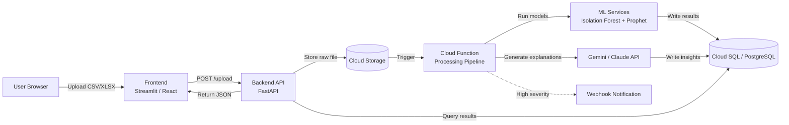
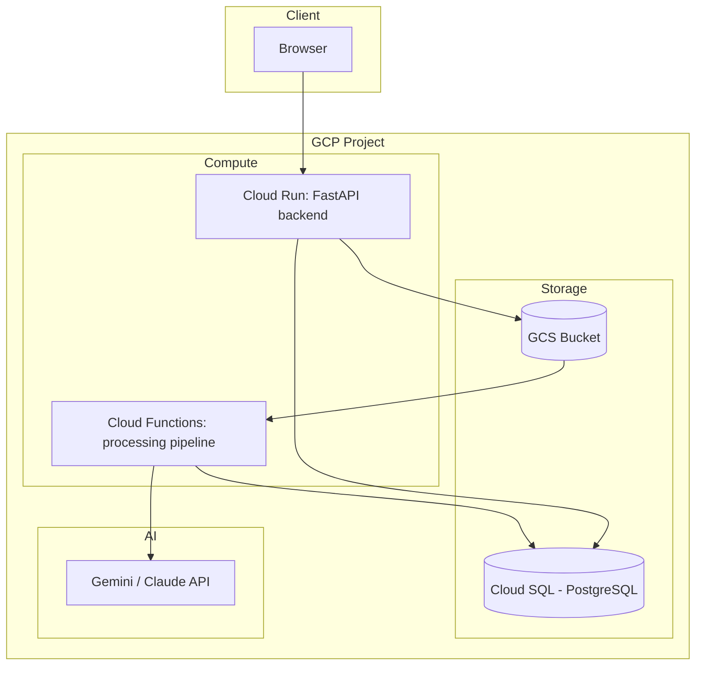

# System Architecture
## Sentinel: Spend Anomaly & Forecast Intelligence Dashboard

---

## 1. Architecture Overview

The system follows an event-driven, serverless-first architecture on Google Cloud, chosen for hackathon speed (minimal ops overhead) and natural alignment with the "cloud infrastructure" judging requirement.

---

## 2. Component Breakdown

| Component | Technology | Responsibility |
|---|---|---|
| **Frontend UI** | Streamlit (prelim) → React.js (final, optional) | File upload, dashboard rendering, drill-down views |
| **Backend API** | Python (FastAPI) | Request routing, validation, orchestration, auth |
| **File Storage** | Google Cloud Storage (GCS) | Durable storage of uploaded raw files |
| **Processing Pipeline** | Cloud Functions / Cloud Run | Event-triggered ETL: parse → detect → forecast → explain |
| **Anomaly Detection** | scikit-learn (Isolation Forest) | Flags outlier transactions |
| **Forecasting Engine** | Prophet (Meta's time-series library) | Predicts next-period spend with confidence intervals |
| **AI Insight Generator** | Gemini Vision/Text API or Claude API | Produces natural-language explanations & recommendations |
| **Database** | Cloud SQL (PostgreSQL) | Stores transactions, anomaly scores, forecasts, insights, audit log |
| **Notification Layer** | Cloud Pub/Sub → Webhook | Pushes alerts for high-severity anomalies |

---

## 3. Data Flow (Step by Step)

1. **Upload:** User uploads a spend data file through the frontend.
2. **Store:** File is saved to Cloud Storage; backend records upload metadata.
3. **Trigger:** File arrival fires a Cloud Function (event-driven, no polling).
4. **Parse & Normalize:** Function parses rows into a structured schema.
5. **Detect:** Isolation Forest scores each transaction; duplicates/math errors flagged via rule checks.
6. **Forecast:** Prophet trains on historical series, produces forecast + confidence band.
7. **Explain:** Flagged anomalies and forecast trends are sent to the AI API for plain-language explanation.
8. **Persist:** All results (scores, forecasts, explanations) written to PostgreSQL.
9. **Notify (optional):** High-severity anomalies trigger a webhook.
10. **Render:** Frontend polls/queries the API and renders the dashboard.

---

## 4. Deployment Architecture

---

## 5. Environment Strategy

| Round | Storage | Compute | Notes |
|---|---|---|---|
| **Preliminary** | In-memory / local SQLite fallback acceptable | Local FastAPI + local script execution acceptable | Prioritize a reliable live demo over full cloud deployment |
| **Final** | Cloud SQL (Postgres) | Cloud Run (API) + Cloud Functions (pipeline) | Fully deployed, publicly accessible link required |

---

## 6. Failure Handling & Resilience

| Risk | Mitigation |
|---|---|
| AI API unavailable/rate-limited | Cache last-known insight; show fallback message; retry with backoff |
| Malformed upload file | Validate schema before processing; return specific error, not a crash |
| Forecast model fails on sparse data | Minimum data-point threshold check before running Prophet; graceful "insufficient data" message |
| Cloud Function cold start delays demo | Pre-warm function before live demo; have a local fallback recording ready |

---

## 7. Scalability Notes (Beyond Hackathon Scope)

- Horizontal scaling via Cloud Run's auto-scaling (stateless API layer)
- Partitioning transaction table by date for large historical datasets
- Batch vs. streaming ingestion could be introduced for real-time ERP integration